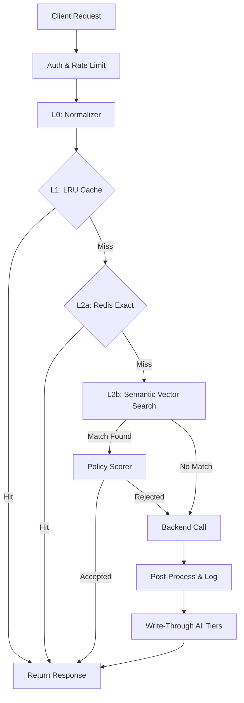

# 🧠 Semantic Cache Proxy (MVP)

[](https://go.dev/)
[](https://www.docker.com/)
[](LICENSE)

An enterprise-grade, high-performance caching proxy designed specifically for **Large Language Models (LLMs)** and probabilistic queries. It dramatically reduces API costs and latencies by safely reusing semantic matches using **time-aware, domain-specific policies**.

---

## 🏗️ Architectural Overview

The proxy operates as a "Smart Gateway" between your application and expensive backends (e.g., GPT-4, Claude). It uses a sophisticated **4-Layer Persistence Strategy** to balance speed with semantic accuracy.



---

## ✨ Key Features

### 🛡️ Secure & Isolated
- **JWT-First**: Native support for Bearer token validation and tenant extraction.
- **Tenant Isolation**: Strict data partitioning—Tenant A can never see Tenant B’s cached answers.
- **Rate Limiting**: Per-tenant token bucket strategy to protect your upstream budget.

### 🧠 Semantic Intelligence
- **Policy-Driven**: Decisions based on Domain, Time-Sensitivity, and Similarity.
- **Categorization**: Automatically classifies queries into `general`, `real-time`, or `strictly-current` to prevent stale data.
- **Deduplication**: Uses `singleflight` to collapse 100 concurrent identical misses into exactly **one** backend call.

### 📊 Enterprise Observability
- **Mission Control**: Built-in Grafana dashboards tracking Cache Hit Ratio (CHR), P95 Latencies, and Net Cost Savings.
- **Audit Trails**: SHA-256 anonymized query hashing for privacy-preserving debug logs.
- **Prometheus Native**: Real-time metrics exposition at `/metrics`.

---

## 🚀 Quick Start

### 1. 🐳 Start the Stack
Bring up the entire ecosystem (DB, Redis, Metrics, Grafana) in one command:
```bash
docker-compose up -d
```

### 2. 👋 Hello World Query
Once started, you can query the proxy using `curl`:
```bash
curl -X POST http://localhost:8080/cache/query \
  -H "Authorization: Bearer <TOKEN>" \
  -H "Content-Type: application/json" \
  -d '{"query": "What is the capital of France?"}'
```

### 3. 📈 View Performance
*   **Grafana**: [http://localhost:3000](http://localhost:3000) (User: `admin` | Pass: `admin`)
*   **Prometheus**: [http://localhost:9091](http://localhost:9091)
*   **Raw Metrics**: [http://localhost:8080/metrics](http://localhost:8080/metrics)

---

## 🧪 Simulation & Testing

To see the system's performance metrics come alive without manual curl calls, use our traffic simulator:

```bash
# Install dependencies
pip install requests

# Run the simulation
python scripts/simulate_load.py
```
This script generates a mix of **Exact Hits**, **Semantic Near-Matches**, and **Cache Misses** to populate your dashboard panels.

---

## 🛠️ Tech Stack

- **Core**: Go 1.22+
- **In-Memory**: Custom LRU (L1)
- **Fast Cache**: Redis 7.2 (L2a)
- **Vector Engine**: PostgreSQL 16 + `pgvector` (L2b)
- **Embeddings**: Ollama (`nomic-embed-text`)
- **Telemetry**: Prometheus + Grafana

---
