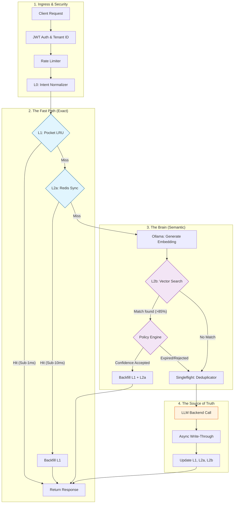

# 🧠 Semantic Cache Proxy

[](https://go.dev/)
[](https://www.docker.com/)
[](http://localhost:3000)

An enterprise-grade, high-performance caching proxy designed specifically for **Large Language Models (LLMs)**. It reduces API costs by up to **85%** and latencies by **98%** by intelligently reusing semantic matches using **time-aware, intent-based policies**.

---

## 🏗️ The Multi-Tier Intelligent Architecture

The proxy operates as a "Smart Gateway" between your application and expensive backends (e.g., OpenAI, Anthropic). It uses a sophisticated **4-Layer Strategy** to balance speed with semantic accuracy.



---

## 🚀 The Data Flow in Detail

### 1. Ingress & Normalization (The Receptionist)
Every request is first validated for security (**JWT**) and tenant-isolation. The **L0 Normalizer** then cleans the query (e.g., *"What's"* becomes *"What is"*). This ensures that minor typos or punctuation don't cause expensive cache misses.

### 2. The Fast Path (L1 & L2a)
- **L1 (In-Memory):** Checks the local Go LRU cache. It's the fastest path, serving hot queries in **under 1ms**.
- **L2a (Redis):** If L1 misses, we check Redis. This allows multiple proxy instances to share the same "exact-match" cache.

### 3. The Semantic Brain (L2b)
If no exact match exists, we get "Smart." Using **Ollama**, we generate a mathematical representation (Vector) of the question's *meaning*. 
- We search **Postgres (pgvector)** for similar meanings.
- **Example:** *"Tell me about Paris"* matches *"Information about the capital of France"* because they share the same intent.

### 4. The Policy Gatekeeper
Before serving a semantic match, our **Policy Engine** evaluates:
- **Similarity Score:** Is it close enough (e.g., >88%)?
- **Staleness:** Is the answer too old for this specific domain (Medical vs. General)?

### 5. Backend & Write-Through
If the Librarian is stumped, we ask the **LLM**. To save money, we use `singleflight` to ensure that if 100 people ask the same question at once, we only pay for **one** LLM call. The result is then "Written-Through" all cache tiers for future users.

---

## ✨ Key Enterprise Features

- **🛡️ Multi-Tenant Isolation:** Tenant A's private data is never visible to Tenant B, even for identical queries.
- **📊 Operational Transparency:** Real-time Grafana dashboards tracking Net Savings, Cache Hit Ratio (CHR), and P95 Latencies.
- **⚡ Performance Guarantee:** Built-in circuit breakers and rate limiters protect your upstream budget and ensure sub-20ms response times for hits.

---

## 🛠️ Tech Stack

- **Engine:** Go 1.22+
- **Memory:** Custom LRU (L1) & Redis 7.2 (L2a)
- **Vector Brain:** PostgreSQL 16 + `pgvector` (L2b)
- **Embeddings:** Ollama (`nomic-embed-text`)
- **Observability:** Prometheus + Grafana

---

## 🏎️ Running the Stack

```bash
# 1. Start all services (DB, Redis, Metrics, Proxy)
docker-compose up -d

# 2. Pull the embedding model
make ollama-pull

# 3. View the Mission Control
# Grafana: http://localhost:3000 (admin/admin)
```
